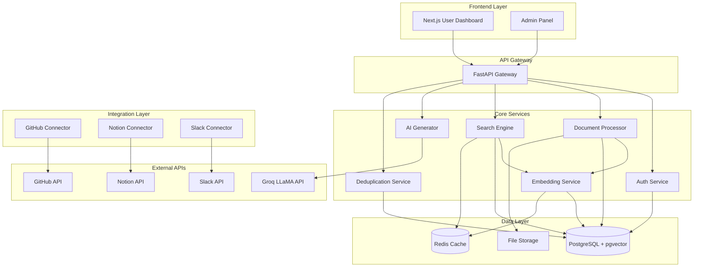
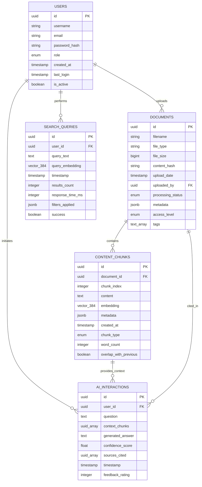

# Knowledge Transfer Platform (KTP) - Technical Design Document

## Overview

The Knowledge Transfer Platform (KTP) is an enterprise-grade knowledge retrieval system that transforms organizational documents into a searchable, AI-powered knowledge base. The system employs a microservices architecture built around semantic search capabilities, enabling employees to discover relevant information through natural language queries and receive AI-generated answers based on company knowledge.

### Core Value Proposition

KTP addresses the common enterprise challenge of knowledge silos by creating a unified, intelligent search interface across all organizational documents. By combining semantic search with AI-powered question answering, employees can quickly find relevant information without needing to know exact keywords or navigate complex folder structures.

### Key Technical Capabilities

- **Semantic Search**: Vector-based similarity search using SentenceTransformer embeddings stored in PostgreSQL with pgvector extension
- **AI Question Answering**: Context-aware response generation using Groq LLaMA models
- **Multi-format Document Processing**: Support for PDF, DOCX, TXT, and MD files with intelligent text extraction and chunking
- **Content Deduplication**: Both exact and semantic similarity detection to prevent redundant content
- **External Integrations**: Automated knowledge ingestion from GitHub, Notion, and Slack
- **Role-Based Access Control**: Enterprise-grade security with Admin, Editor, and Viewer roles
- **Real-time Analytics**: Comprehensive usage monitoring and performance metrics

## Architecture

### System Architecture Overview

The KTP system follows a modular microservices architecture designed for scalability, maintainability, and clear separation of concerns. The architecture consists of several specialized services orchestrated through a central API gateway.



### Service Responsibilities

**API Gateway (FastAPI)**
- Request routing and load balancing
- Authentication middleware
- Rate limiting and request validation
- API documentation and versioning
- Centralized logging and monitoring

**Auth Service**
- User authentication and session management
- Role-based access control (RBAC)
- Permission validation
- Security audit logging

**Document Processor**
- Multi-format file parsing (PDF, DOCX, TXT, MD)
- Text extraction and cleaning
- Intelligent content chunking
- Metadata extraction and enrichment

**Embedding Service**
- Vector embedding generation using SentenceTransformer bge-small
- Batch processing optimization
- Embedding cache management
- Model version management

**Search Engine**
- Semantic similarity search using pgvector
- Query optimization and filtering
- Result ranking and relevance scoring
- Search analytics and logging

**AI Generator**
- Context-aware answer generation using Groq LLaMA
- Source citation and confidence scoring
- Response quality monitoring
- Conversation context management

**Deduplication Service**
- Content hash generation for exact duplicates
- Semantic similarity analysis for near-duplicates
- Duplicate resolution workflows
- Deduplication audit trails

## Components and Interfaces

### Core Components

#### Authentication & Authorization Component

**Purpose**: Manages user identity, authentication, and role-based access control across the entire platform.

**Key Interfaces**:
```python
class AuthService:
    def authenticate_user(credentials: UserCredentials) -> AuthResult
    def validate_session(session_token: str) -> SessionInfo
    def check_permission(user_id: str, resource: str, action: str) -> bool
    def create_session(user_id: str) -> SessionToken
    def revoke_session(session_token: str) -> bool
```

**Integration Points**:
- All API endpoints for permission validation
- Admin Panel for user management
- Audit logging system for security events

#### Document Processing Component

**Purpose**: Handles document ingestion, text extraction, and preparation for embedding generation.

**Key Interfaces**:
```python
class DocumentProcessor:
    def process_document(file: UploadedFile) -> ProcessingResult
    def extract_text(file_path: str, file_type: str) -> ExtractedText
    def chunk_content(text: str, metadata: dict) -> List[ContentChunk]
    def validate_file_format(file: UploadedFile) -> ValidationResult
```

**Processing Pipeline**:
1. File format validation and virus scanning
2. Text extraction using format-specific parsers
3. Content cleaning and normalization
4. Intelligent chunking with overlap preservation
5. Metadata enrichment and tagging

#### Embedding & Vector Component

**Purpose**: Generates and manages vector embeddings for semantic search capabilities.

**Key Interfaces**:
```python
class EmbeddingService:
    def generate_embedding(text: str) -> VectorEmbedding
    def batch_generate_embeddings(texts: List[str]) -> List[VectorEmbedding]
    def update_embedding_model(model_path: str) -> bool
    def get_embedding_dimensions() -> int
```

**Technical Specifications**:
- Model: SentenceTransformer bge-small-en-v1.5
- Embedding Dimensions: 384
- Batch Size: 32 for optimal GPU utilization
- Caching: Redis-based embedding cache with TTL

#### Search Engine Component

**Purpose**: Performs semantic similarity searches and result ranking.

**Key Interfaces**:
```python
class SearchEngine:
    def semantic_search(query: str, filters: SearchFilters) -> SearchResults
    def similarity_search(embedding: VectorEmbedding, limit: int) -> List[SimilarityMatch]
    def filter_by_permissions(results: SearchResults, user: User) -> SearchResults
    def rank_results(results: List[SimilarityMatch]) -> List[RankedResult]
```

**Search Features**:
- Vector similarity using cosine distance
- Hybrid search combining semantic and keyword matching
- Permission-aware result filtering
- Configurable similarity thresholds
- Search result caching and optimization

#### AI Question Answering Component

**Purpose**: Generates contextual answers using retrieved knowledge and LLaMA models.

**Key Interfaces**:
```python
class AIGenerator:
    def generate_answer(question: str, context: List[ContentChunk]) -> AIResponse
    def assess_confidence(question: str, context: List[ContentChunk]) -> float
    def cite_sources(response: str, context: List[ContentChunk]) -> List[Citation]
    def validate_context_relevance(question: str, context: List[ContentChunk]) -> bool
```

**Generation Pipeline**:
1. Context relevance assessment
2. Prompt engineering with retrieved chunks
3. LLaMA model inference via Groq API
4. Response post-processing and citation extraction
5. Confidence scoring and quality validation

### External Integration Components

#### GitHub Integration
- Repository documentation synchronization
- README and wiki content extraction
- Branch-aware content updates
- Access control integration with GitHub permissions

#### Notion Integration
- Page and database content extraction
- Hierarchical content structure preservation
- Real-time webhook-based updates
- Notion permission mapping to KTP roles

#### Slack Integration
- Channel message indexing with thread context
- File attachment processing
- User permission synchronization
- Configurable channel inclusion/exclusion

## Data Models

### Core Data Entities

#### User Entity
```python
class User:
    id: UUID
    username: str
    email: str
    password_hash: str
    role: UserRole  # ADMIN, EDITOR, VIEWER
    created_at: datetime
    last_login: datetime
    is_active: bool
    permissions: List[Permission]
```

#### Document Entity
```python
class Document:
    id: UUID
    filename: str
    file_type: str  # PDF, DOCX, TXT, MD
    file_size: int
    content_hash: str
    upload_date: datetime
    uploaded_by: UUID  # User ID
    processing_status: ProcessingStatus
    metadata: dict
    access_level: AccessLevel
    tags: List[str]
```

#### Content Chunk Entity
```python
class ContentChunk:
    id: UUID
    document_id: UUID
    chunk_index: int
    content: str
    embedding: List[float]  # 384-dimensional vector
    metadata: dict
    created_at: datetime
    chunk_type: ChunkType  # PARAGRAPH, SECTION, TABLE, etc.
    word_count: int
    overlap_with_previous: bool
```

#### Search Query Entity
```python
class SearchQuery:
    id: UUID
    user_id: UUID
    query_text: str
    query_embedding: List[float]
    timestamp: datetime
    results_count: int
    response_time_ms: int
    filters_applied: dict
    success: bool
```

#### AI Interaction Entity
```python
class AIInteraction:
    id: UUID
    user_id: UUID
    question: str
    context_chunks: List[UUID]  # ContentChunk IDs
    generated_answer: str
    confidence_score: float
    sources_cited: List[UUID]  # Document IDs
    timestamp: datetime
    feedback_rating: Optional[int]  # 1-5 scale
```

### Database Schema Design

#### PostgreSQL Tables with pgvector

**users table**
```sql
CREATE TABLE users (
    id UUID PRIMARY KEY DEFAULT gen_random_uuid(),
    username VARCHAR(50) UNIQUE NOT NULL,
    email VARCHAR(255) UNIQUE NOT NULL,
    password_hash VARCHAR(255) NOT NULL,
    role VARCHAR(20) NOT NULL CHECK (role IN ('ADMIN', 'EDITOR', 'VIEWER')),
    created_at TIMESTAMP DEFAULT CURRENT_TIMESTAMP,
    last_login TIMESTAMP,
    is_active BOOLEAN DEFAULT true
);
```

**documents table**
```sql
CREATE TABLE documents (
    id UUID PRIMARY KEY DEFAULT gen_random_uuid(),
    filename VARCHAR(255) NOT NULL,
    file_type VARCHAR(10) NOT NULL,
    file_size BIGINT NOT NULL,
    content_hash VARCHAR(64) UNIQUE NOT NULL,
    upload_date TIMESTAMP DEFAULT CURRENT_TIMESTAMP,
    uploaded_by UUID REFERENCES users(id),
    processing_status VARCHAR(20) DEFAULT 'PENDING',
    metadata JSONB,
    access_level VARCHAR(20) DEFAULT 'INTERNAL',
    tags TEXT[]
);
```

**content_chunks table**
```sql
CREATE TABLE content_chunks (
    id UUID PRIMARY KEY DEFAULT gen_random_uuid(),
    document_id UUID REFERENCES documents(id) ON DELETE CASCADE,
    chunk_index INTEGER NOT NULL,
    content TEXT NOT NULL,
    embedding vector(384),  -- pgvector extension
    metadata JSONB,
    created_at TIMESTAMP DEFAULT CURRENT_TIMESTAMP,
    chunk_type VARCHAR(20) DEFAULT 'PARAGRAPH',
    word_count INTEGER,
    overlap_with_previous BOOLEAN DEFAULT false
);

-- Create vector similarity index
CREATE INDEX ON content_chunks USING ivfflat (embedding vector_cosine_ops) WITH (lists = 100);
```

**search_queries table**
```sql
CREATE TABLE search_queries (
    id UUID PRIMARY KEY DEFAULT gen_random_uuid(),
    user_id UUID REFERENCES users(id),
    query_text TEXT NOT NULL,
    query_embedding vector(384),
    timestamp TIMESTAMP DEFAULT CURRENT_TIMESTAMP,
    results_count INTEGER,
    response_time_ms INTEGER,
    filters_applied JSONB,
    success BOOLEAN DEFAULT true
);
```

**ai_interactions table**
```sql
CREATE TABLE ai_interactions (
    id UUID PRIMARY KEY DEFAULT gen_random_uuid(),
    user_id UUID REFERENCES users(id),
    question TEXT NOT NULL,
    context_chunks UUID[],
    generated_answer TEXT NOT NULL,
    confidence_score FLOAT CHECK (confidence_score >= 0 AND confidence_score <= 1),
    sources_cited UUID[],
    timestamp TIMESTAMP DEFAULT CURRENT_TIMESTAMP,
    feedback_rating INTEGER CHECK (feedback_rating >= 1 AND feedback_rating <= 5)
);
```

#### Indexing Strategy

**Performance Indexes**:
```sql
-- Vector similarity search optimization
CREATE INDEX idx_content_chunks_embedding ON content_chunks USING ivfflat (embedding vector_cosine_ops);

-- Text search support
CREATE INDEX idx_content_chunks_content_gin ON content_chunks USING gin(to_tsvector('english', content));

-- Query performance indexes
CREATE INDEX idx_documents_upload_date ON documents(upload_date DESC);
CREATE INDEX idx_documents_uploaded_by ON documents(uploaded_by);
CREATE INDEX idx_content_chunks_document_id ON content_chunks(document_id);
CREATE INDEX idx_search_queries_user_timestamp ON search_queries(user_id, timestamp DESC);
CREATE INDEX idx_ai_interactions_user_timestamp ON ai_interactions(user_id, timestamp DESC);

-- Deduplication support
CREATE INDEX idx_documents_content_hash ON documents(content_hash);
CREATE INDEX idx_documents_filename_size ON documents(filename, file_size);
```

#### Data Relationships



## Correctness Properties

*A property is a characteristic or behavior that should hold true across all valid executions of a system-essentially, a formal statement about what the system should do. Properties serve as the bridge between human-readable specifications and machine-verifiable correctness guarantees.*

### Property 1: Authentication Session Creation

*For any* valid user credentials, successful authentication should create a session token that can be used to access protected resources until expiration.

**Validates: Requirements 1.1, 1.4**

### Property 2: Role-Based Access Control

*For any* user and protected resource, access should be granted if and only if the user's role has the required permissions for that resource.

**Validates: Requirements 1.2**

### Property 3: Authentication Audit Logging

*For any* authentication attempt (successful or failed), the system should create a corresponding audit log entry with timestamp and user details.

**Validates: Requirements 1.5**

### Property 4: Document Processing Pipeline

*For any* uploaded document in a supported format, the complete processing pipeline (text extraction, cleaning, chunking, embedding generation, and storage) should produce retrievable content chunks with valid embeddings.

**Validates: Requirements 2.1, 2.3, 2.4, 2.5, 2.6, 2.7**

### Property 5: Upload Error Handling

*For any* document upload that fails at any stage, the system should provide a descriptive error message indicating the specific failure reason.

**Validates: Requirements 2.8**

### Property 6: Semantic Search Pipeline

*For any* search query, the system should convert it to a vector embedding, perform similarity search against stored embeddings, and return results ranked by similarity score.

**Validates: Requirements 3.1, 3.2, 3.3**

### Property 7: Search Result Filtering

*For any* search query with applied filters (document type, upload date, access permissions), all returned results should satisfy the specified filter criteria.

**Validates: Requirements 3.4**

### Property 8: AI Answer Generation with Citations

*For any* question with sufficient context, the AI system should generate an answer that includes proper source citations and a confidence score between 0 and 1.

**Validates: Requirements 4.1, 4.2, 4.3, 4.4**

### Property 9: AI Interaction Logging

*For any* AI question-answering interaction, the system should log the question, context used, generated answer, and confidence score for quality monitoring.

**Validates: Requirements 4.6**

### Property 10: Content Deduplication Detection

*For any* uploaded document, the system should check for both exact duplicates (using content hashing) and semantic duplicates (using embedding similarity) before storage.

**Validates: Requirements 5.1, 5.2, 5.3**

### Property 11: Duplicate Resolution Workflow

*For any* detected duplicate content, the system should prompt the user for confirmation and log the deduplication decision for audit purposes.

**Validates: Requirements 5.4, 5.5**

### Property 12: External Integration Sync

*For any* enabled external integration (GitHub, Notion, Slack), the system should sync content according to access permissions while respecting API rate limits.

**Validates: Requirements 6.1, 6.2, 6.3, 6.4**

### Property 13: Integration Error Recovery

*For any* failed integration sync operation, the system should log the error and implement exponential backoff retry logic.

**Validates: Requirements 6.5**

### Property 14: Usage Analytics Tracking

*For any* user interaction (search query, document upload, AI question), the system should track relevant metrics including success rates, response times, and usage patterns.

**Validates: Requirements 7.1, 7.2**

### Property 15: System Monitoring and Alerting

*For any* system performance degradation or threshold breach, the system should generate appropriate alerts and update real-time metrics displays.

**Validates: Requirements 7.4, 7.5**

### Property 16: Administrative Management Operations

*For any* administrative operation (user management, document management, system configuration), the system should validate inputs, apply changes atomically, and maintain audit trails.

**Validates: Requirements 8.1, 8.2, 8.3, 8.5**

### Property 17: Backup and Restore Operations

*For any* backup or restore operation, the system should maintain data integrity and provide verification that the operation completed successfully.

**Validates: Requirements 8.4**

### Property 18: Concurrent Document Processing

*For any* set of simultaneously uploaded documents, the system should process them concurrently without data corruption or resource conflicts.

**Validates: Requirements 9.3**

### Property 19: Database Performance Optimization

*For any* vector similarity query, the system should utilize pgvector indexes and connection pooling to maintain optimal performance.

**Validates: Requirements 9.4**

### Property 20: API Error Handling Consistency

*For any* API endpoint request with invalid parameters, the system should return standardized error responses with appropriate HTTP status codes.

**Validates: Requirements 10.3, 10.6**

### Property 21: Real-time User Feedback

*For any* long-running operation (document upload, processing), the user interface should provide real-time progress feedback and status updates.

**Validates: Requirements 10.4**

## Error Handling

### Error Classification and Response Strategy

The KTP system implements a comprehensive error handling strategy that categorizes errors by severity and provides appropriate responses for each category.

#### Error Categories

**1. User Input Errors (4xx HTTP Status)**
- Invalid file formats or corrupted uploads
- Malformed search queries or API requests
- Authentication failures and permission denials
- Response: Immediate user feedback with actionable guidance

**2. System Processing Errors (5xx HTTP Status)**
- Document processing failures (text extraction, chunking)
- Embedding generation failures
- Database connection or query failures
- Response: Graceful degradation with retry mechanisms

**3. External Service Errors**
- Groq API rate limiting or service unavailability
- External integration API failures (GitHub, Notion, Slack)
- Network connectivity issues
- Response: Circuit breaker pattern with exponential backoff

**4. Resource Exhaustion Errors**
- Database connection pool exhaustion
- Memory or disk space limitations
- Processing queue overflow
- Response: Load shedding and resource management

#### Error Handling Patterns

**Circuit Breaker Pattern**
```python
class CircuitBreaker:
    def __init__(self, failure_threshold: int = 5, timeout: int = 60):
        self.failure_threshold = failure_threshold
        self.timeout = timeout
        self.failure_count = 0
        self.last_failure_time = None
        self.state = "CLOSED"  # CLOSED, OPEN, HALF_OPEN
    
    def call(self, func, *args, **kwargs):
        if self.state == "OPEN":
            if time.time() - self.last_failure_time > self.timeout:
                self.state = "HALF_OPEN"
            else:
                raise CircuitBreakerOpenError()
        
        try:
            result = func(*args, **kwargs)
            if self.state == "HALF_OPEN":
                self.state = "CLOSED"
                self.failure_count = 0
            return result
        except Exception as e:
            self.failure_count += 1
            self.last_failure_time = time.time()
            if self.failure_count >= self.failure_threshold:
                self.state = "OPEN"
            raise e
```

**Retry with Exponential Backoff**
```python
async def retry_with_backoff(
    func: Callable,
    max_retries: int = 3,
    base_delay: float = 1.0,
    max_delay: float = 60.0,
    backoff_factor: float = 2.0
):
    for attempt in range(max_retries + 1):
        try:
            return await func()
        except RetryableError as e:
            if attempt == max_retries:
                raise e
            
            delay = min(base_delay * (backoff_factor ** attempt), max_delay)
            await asyncio.sleep(delay)
```

#### Error Response Format

All API errors follow a standardized JSON response format:

```json
{
    "error": {
        "code": "DOCUMENT_PROCESSING_FAILED",
        "message": "Failed to extract text from PDF document",
        "details": {
            "file_name": "document.pdf",
            "error_type": "UnsupportedPDFVersion",
            "suggested_action": "Please ensure the PDF is not password-protected and uses a supported version"
        },
        "timestamp": "2024-01-15T10:30:00Z",
        "request_id": "req_123456789"
    }
}
```

#### Monitoring and Alerting

**Error Rate Monitoring**
- Track error rates by endpoint, error type, and user
- Alert when error rates exceed baseline thresholds
- Implement automated escalation for critical errors

**Error Impact Assessment**
- Categorize errors by business impact (critical, high, medium, low)
- Prioritize resolution based on user impact and system stability
- Maintain error budgets for service level objectives

## Testing Strategy

### Comprehensive Testing Approach

The KTP system employs a dual testing strategy combining traditional unit testing with property-based testing to ensure both specific behavior validation and comprehensive input coverage.

#### Unit Testing Strategy

**Scope and Focus**
- Specific examples demonstrating correct behavior
- Edge cases and boundary conditions
- Integration points between components
- Error conditions and exception handling
- Mock external dependencies for isolated testing

**Testing Framework**: pytest with asyncio support for Python components, Jest for Next.js frontend

**Key Unit Test Categories**:

1. **Authentication Tests**
   - Valid/invalid credential combinations
   - Session expiration scenarios
   - Role-based access control edge cases
   - Security audit logging verification

2. **Document Processing Tests**
   - File format validation edge cases
   - Text extraction from corrupted files
   - Chunking boundary conditions
   - Embedding generation error handling

3. **Search Engine Tests**
   - Empty query handling
   - Filter combination edge cases
   - Permission boundary testing
   - Result ranking verification

4. **Integration Tests**
   - API rate limit handling
   - External service failure scenarios
   - Data consistency across service boundaries
   - End-to-end workflow validation

#### Property-Based Testing Strategy

**Framework**: Hypothesis for Python components, fast-check for TypeScript/JavaScript components

**Configuration Requirements**:
- Minimum 100 iterations per property test
- Configurable seed for reproducible failures
- Shrinking enabled for minimal failing examples
- Timeout protection for long-running properties

**Property Test Implementation**:

Each correctness property from the design document must be implemented as a property-based test with the following tag format:

```python
@given(st.text(min_size=1, max_size=1000))
def test_authentication_session_creation(credentials):
    """
    Feature: ktp-platform, Property 1: For any valid user credentials, 
    successful authentication should create a session token that can be 
    used to access protected resources until expiration.
    """
    # Property test implementation
```

**Property Test Categories**:

1. **Data Integrity Properties**
   - Document upload → processing → retrieval round-trip
   - Embedding generation consistency
   - Search result relevance preservation

2. **Security Properties**
   - Authentication token validity
   - Permission enforcement across all resources
   - Audit trail completeness

3. **Performance Properties**
   - Search response time bounds
   - Concurrent processing safety
   - Resource utilization limits

4. **Integration Properties**
   - External API error handling
   - Retry mechanism correctness
   - Data synchronization consistency

#### Test Data Management

**Synthetic Data Generation**
- Realistic document content generation for testing
- User profile and permission matrix generation
- Search query pattern simulation
- Load testing data sets

**Test Environment Isolation**
- Containerized test databases with pgvector
- Mock external API services
- Isolated file storage for test documents
- Clean state between test runs

#### Continuous Testing Pipeline

**Pre-commit Testing**
- Unit tests for changed components
- Property tests for affected properties
- Code quality and security scanning
- Documentation generation validation

**CI/CD Integration**
- Full test suite execution on pull requests
- Performance regression testing
- Integration testing against staging environment
- Automated deployment validation

**Monitoring and Feedback**
- Test execution time tracking
- Flaky test identification and resolution
- Coverage reporting and gap analysis
- Property test failure analysis and shrinking

#### Test Coverage Requirements

**Minimum Coverage Targets**:
- Unit test coverage: 85% line coverage
- Property test coverage: 100% of design properties
- Integration test coverage: All API endpoints
- End-to-end test coverage: Critical user workflows

**Coverage Exclusions**:
- External library code
- Generated code (database migrations, API schemas)
- Development and debugging utilities
- Performance testing harnesses

The dual testing approach ensures that the KTP system maintains high reliability through specific scenario validation (unit tests) while also verifying universal correctness properties across all possible inputs (property-based tests). This comprehensive strategy provides confidence in system behavior under both expected and unexpected conditions.